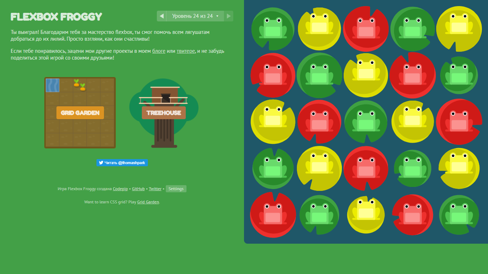

<!-- AUTO-GENERATED-CONTENT:START (STARTER) -->
<h1 align="center">
    Linux CLI, and HTTP
</h1>

<ul>
<li>Good explanation what is command line in Linux</li>
<li>Quiz is a must on all stages of this course</li>
<li>Very good extra material to get familiar with basics of Frontend develompent</li>

</ul>
<h1 align="center">
    Git Collaboration
</h1>

<ul>
<li>Good explanation what is Git</li>
<li>Quiz</li>
<li>Advenced level was pretty hard</li>
</ul>
<h1 align="center">
   Intro to HTML and CSS
</h1>

<ul>
<li>Good explanation what is HTML and CSS</li>
<li>Practical tasks</li>
</ul>
<h1 align="center">
   Responsive Web Design
</h1>

<ul>
<li>Good explanation what is RWD</li>
<li>Flexbox Froggy is Amazing!</li>
</ul>
<!-- AUTO-GENERATED-CONTENT:END -->